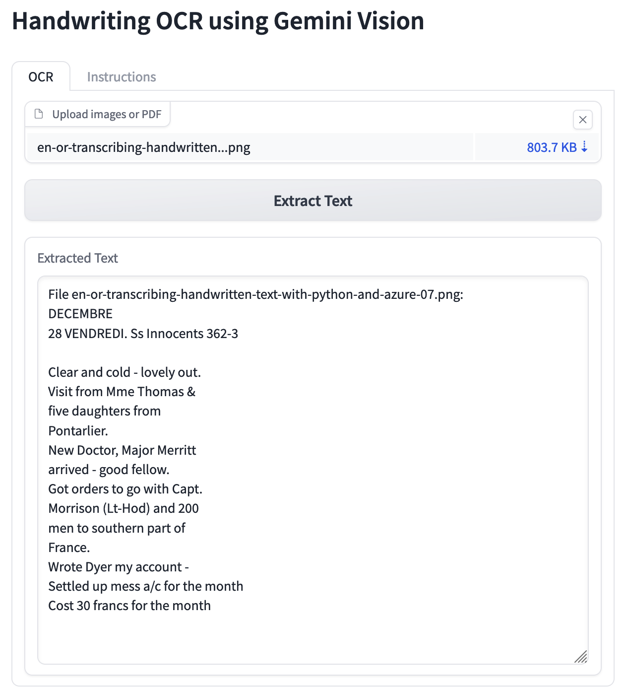

#readme

yes, I used claude artifacts to cook this up. 
memo to self: https://claude.ai/chat/9c6e14bb-403f-4841-bdf4-3536af2dc853 

you need poppler to handle the pdfs

on mac: `brew install poppler`

to use: make a conda environment

`conda create -n handwriter python=3.10`

`conda activate handwriter`

`pip install -r requirements.txt`

`python app.py`

Then your app will be available at http://127.0.0.1:7860/

Give it your gemini api key, to store it locally.

Then upload images/pdfs to pass them through & get the extracted text back.

PNG images that have an 'alpha' channel currently cause an error.

Test images are from the West Kennet Archaeological society, and from Jeff Blackadar's Progrmming Historian tutorial.

More functions to come. Although maybe this would all just be better via a notebook. Anywhoo.

Interesting - when I pass the italian site diary from Gabii, it jumps straight to translation rather than provide the verbatim text. Maybe this is a feature, not a bug. Modifying the prompt to prevent that behaviour may or may not be desired. The prompt currently instructs the model to describe any other imagery on the page that isn't handwriting - see below:

